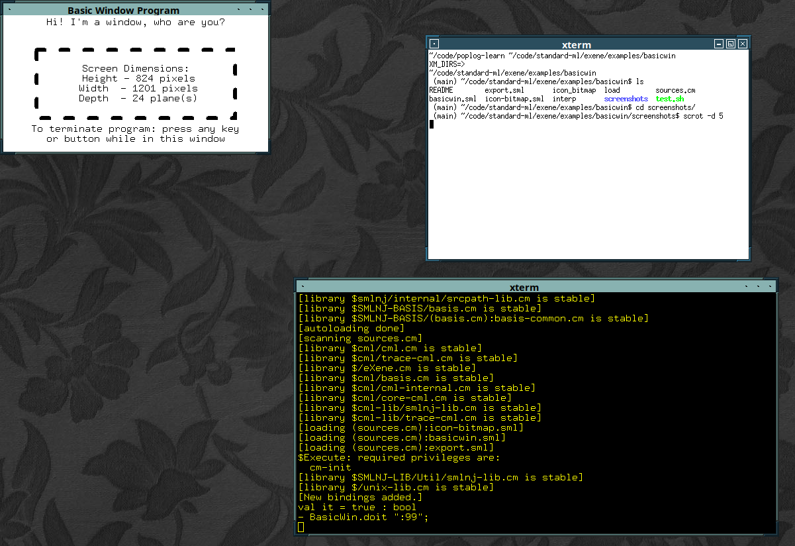
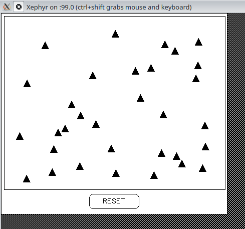

# standard-ml
ml-for-the-working-programmer


# eXene 

# eXene basic window 




# eXene triangle



Lets first test we can get a clock on the screen using a c based program.
If you see a clock then congratulations 

```
xclock
```

mlx uses Big endian-ness whilst amd64 is little-endian

to get graphics to work need to start a Xephr server 

```
Xephyr :99 -sw-cursor -retro -screen 800x600 -ac +extension GLX &
```

then start standard ml smlnj

```
sml
> CM.make("sources.cm");
> Main.doit ":99";

```

in trying to get eXene graphics library examples up and running we encountered some errors . 
code uses receive and accept which are not present in CML.

```
Old (pre-110)         Modern (110+)       equivalent Notes
-----------------------------------------------------------
CML.receive chan   | CML.recv chan      | Receives on a channel; blocks until data arrives
CML.accept chan    | CML.recvEvt chan   | Returns an event for receiving on a channel
CML.send chan x    | CML.send chan x    | Sends on a channel; blocks until receiver is ready
CML.sendEvt chan x | CML.sendEvt chan x | Returns an event for sending on a channel
-----------------------------------------------------------
```


# system info 

using binary download x86-64 bit version 

```
- open SMLofNJ.SysInfo;
opening SMLofNJ.SysInfo
  exception UNKNOWN
  datatype os_kind = UNIX | WIN32
  val getOSKind : unit -> os_kind
  val getOSName : unit -> string
  val getOSVersion : unit -> string
  val getArchName : unit -> string
  val getArchSize : unit -> int
  val getHostSize : unit -> int
  val getHostArch : unit -> string
  val getTargetArch : unit -> string
  val hasSoftwarePolling : unit -> bool
  val hasMultiprocessing : unit -> bool
  val getHeapSuffix : unit -> string
  ```
pre-compiled version reports 
  
  ```
- SMLofNJ.SysInfo.getOSKind();
val it = UNIX : os_kind
- SMLofNJ.SysInfo.getOSName();
val it = "Linux" : string
- SMLofNJ.SysInfo.getOSVersion();
val it = "<unknown>" : string
- SMLofNJ.SysInfo.getArchName();
val it = "AMD64" : string
- SMLofNJ.SysInfo.getArchSize();
val it = 64 : int
- SMLofNJ.SysInfo.getHostArch();
val it = "AMD64" : string
- SMLofNJ.SysInfo.getTargetArch();
val it = "AMD64" : string
- SMLofNJ.SysInfo.hasSoftwarePolling(); 
val it = false : bool
- SMLofNJ.SysInfo.hasMultiprocessing(); 
val it = false : bool
- SMLofNJ.SysInfo.getHeapSuffix(); 
val it = "amd64-linux" : string
```


