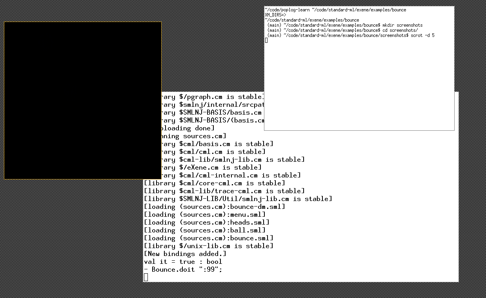

# bounce

This directory contains a silly demo that allows the user to
create and destroy bouncing balls.  Mouse button-1 creates
a new ball, button-2 will kill the ball(s) that are pointed
at by the cursor, typing "x" will quit the application.
Mouse button-3 pops up a simple menu.



# build 

```
CM.make("sources.cm");
Bounce.doit ":1";
```

# error Authorization required

This error is due to incorrect DISPLAY on xserver setting

exception (XERROR connection refused: Authorization required, but no authorization protocol specified
) in bounce thread
  ** eXene/lib/misc/mlx-err.sml:10.26-10.36
val it = 0 : OS.Process.status

```

```

# error wrong Endianess 

exception (XERROR connection refused: Prohibited client endianess, see the Xserver man page ) in bounce thread
  ** eXene/lib/misc/mlx-err.sml:10.26-10.36
val it = 0 : OS.Process.status

This is due to wrong endianess - we need a xephyr server to fix this 

from bash shell prompt - xterm - 

```
Xephyr :99 -sw-cursor -retro -resizeable -screen 800x600 -ac +extension GLX &
DISPLAY=':99' 
xterm &
# lastly start a window manager
fvwm3 &
```

inside the new window which should look similar to this 

```
CM.make("sources.cm");
Bounce.doit ":99";
```

A black screen will appear , mouse can be moved and has a menu with a couple of options

